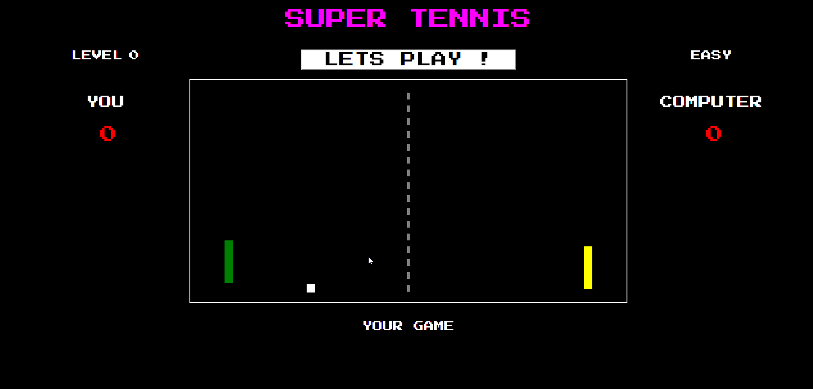

# TENIS
Simple oldschool tennis game (pong) for two players: you and computer. 

## Table of contents
* [General info](#general-info)
* [Screenshots](#screenshots)
* [Technologies](#technologies)
* [Setup](#setup)
* [Features](#features)
* [Status](#status)
* [Inspiration](#inspiration)
* [Contact](#contact)

## General info
A game made with tuorial made by Samuraj Programowania. Graphics are made in Canvas API. Game has AI elements, paddle is controled by mouse move. Interface, point counter and game score are my developement of rhe tutorial. 

## Screenshots

## Technologies
* HTML5
* CSS6
* JAVASCRIPT/CANVAS
* Written in Visual Studio Code

## Setup
Link to demo version:  https://egwizdala.github.io/TENIS/

## Features
* collision detection
* AI
* Mouse control
* Points counter

## Status
Project is:_finished_

## Inspiration
Project based on Samuraj PRogramowania tutorial: https://www.youtube.com/watch?v=8IJ_1QcqMdM&list=PLTs20Q-BTEMMSpaBeLpGECE3748o2MOFD&index=1&ab_channel=SamurajProgramowania

## Contact
Created by Emilia Gwizdala [emilia.gwizdala@gmail.com](https://www.flynerd.pl/) - feel free to contact me!

